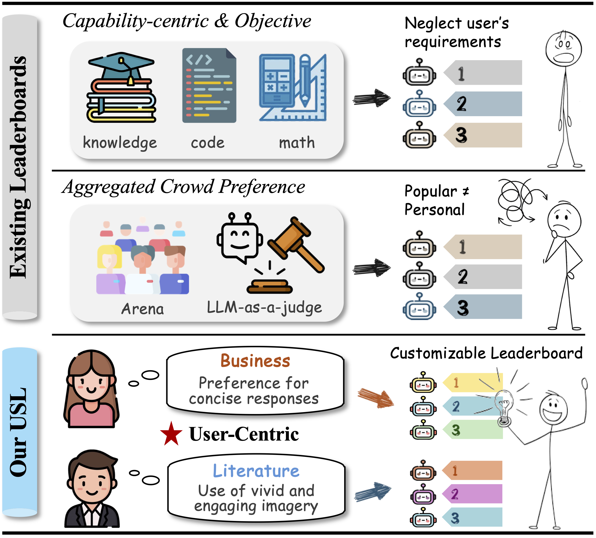
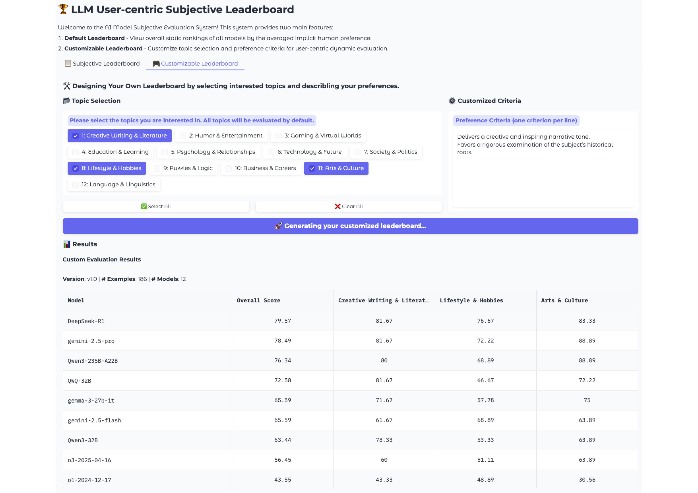

<div align= "center">
    <h1> User-centric Subjective Leaderboard via Customizable Reward Modeling </h1>
</div>

<div align= "center">
<p>
<a href="https://arxiv.org/abs/2508.09463">📖 Arxiv</a> |
<!-- <a href="https://huggingface.co/datasets/ASCIIEval/ASCIIEval">🤗 ASCIIEval Dataset</a> |
<a href="https://huggingface.co/datasets/ASCIIEval/ASCIITune">🤗 ASCIITune Dataset</a> -->
</p>
</div>


Existing benchmarks for large language models (LLMs) predominantely focus on assessing their capabilities through verifiable tasks. Such objective and static benchmarks offer limited utility for practical LLM selection, making it difficult for users to find suitable models for their individual needs. Other arena-based evaluations and LLM-as-a-judge benchmarks complement objective leaderboards, but unfortunately only reflect the aggregated preferences of the general public. To bridge this gap, we present the first User-Centric Subjective Leaderboard (USL), which provides a preference-driven, dynamic ranking of LLMs across diverse real-world scenarios. Our work is built upon a thorough investigation of real human preference data, involving more than 10K subjective queries. Our investigation reveals significant diversity and contradictions in human preferences, which limit the effectiveness of state-of-the-art reward models. To address this, we introduce Customizable Reward Models (CRMs). With only 4B parameters, our CRM surpasses the performance of leading models such as GPT-4.1 and Gemini-2.5-pro, showing exceptional generalization capabilities across new topics and criteria. The USL, powered by CRMs, exhibits strong negative correlations to contradictory preferences.

<h1 align="center">

<br>
</h1>

# Customizable Reward Modeling

## Requirements

* python >= 3.10
* pyTorch >= 2.4.0
* transformers >= 4.51.3
* trl >= 0.18.1
* Additional: `datasets`, `flash_attn`, etc.

The important dependencies and their version information are listed in the `requirements.txt` file.


## Data Format

Examples of training / test data use the **JSON Lines** format (one sample per line):

```json
{
  "idx": 0,
  "prompt": "user initial query",
  "model_a": [{'role': 'user', 'content': '...'}, {'role': 'assistant', 'content': '...'}],
  "model_b": [{'role': 'user', 'content': '...'}, {'role': 'assistant', 'content': '...'}],
  "criteria": ["...", "...", "..."],
  "preference": "model_a"  // or "model_b" or "tie"
}
```

The data will be open-sourced soon. Please stay tuned for updates.


## Train a Customizable Reward Model

A script for training pointwise customizable reward model is provided:

```bash
bash scripts/train_rm.sh
```

A script for training pairwise customizable reward model is provided:

```bash
bash scripts/train_rm_pair.sh
```

Key custom arguments:

| Argument | Description |
|----------|-------------|
| `--model_name_or_path` | Path to the model checkpoint |
| `--data_path` | Path to the training/validation file |
| `--data_direction` | `original` / `reverse` / `random` — controls the order of chosen vs. rejected |
| `--data_noise` | `none` / `add` / `remove` / `replace` / `random` — manipulates noising strategy for criteria  |

## Evaluate a Reward Model

Run the example script:

```bash
bash scripts/eval.sh
```

# User-centric Subjective Leaderboard

Based on CRMs, we introduce the first User-centric Subjective Leaderboard (USL), enabling dynamic LLM rankings customizable to individual user preferences and needs.

An screenshot of the interactive interface is shown below. Users can select topics of interest and input personalized preference criteria to obtain a customized model leaderboard.

<h1 align="center">

</h1>

The relevant material will be open-sourced soon.


# Project Layout

```text
.
├── data/
│   ├── train_val_data.jsonl            # training data
│   ├── test_set/                       # test data 
│   ├── subjective_leaderboard_test_set.jsonl # benchmark data for USL
│   └──
├── src/                                
│   ├── data/                           # datasets & collators
│   ├── trainer/                        # custom trainers for reward modeling
│   ├── utils/                          # common helpers, metrics, seeding
│       └── prompt.py                       # system / user prompt templates
│   ├── train_rm.py                     # point-wise RM training entry
│   ├── train_rm_pair.py                # pair-wise RM training entry
│   └── eval.py                         # evaluation entry
├── scripts/                            # one-line bash wrappers
│   ├── train_rm.sh
│   ├── train_rm_pair.sh
│   └── eval.sh
└── README.md
```


## Citation

```
@article{jia2025usl,
  title={User-centric Subjective Leaderboard via Customizable Reward Modeling},
  author={Jia, Qi and Song, Xiujie and Zhang, Zicheng and Guo, Yijin and Zhang, Kaiwei and Chen, Zijian and Zhai, Guangtao},
  journal={arXiv preprint arXiv:2508.09463},
  year={2025}
}
```