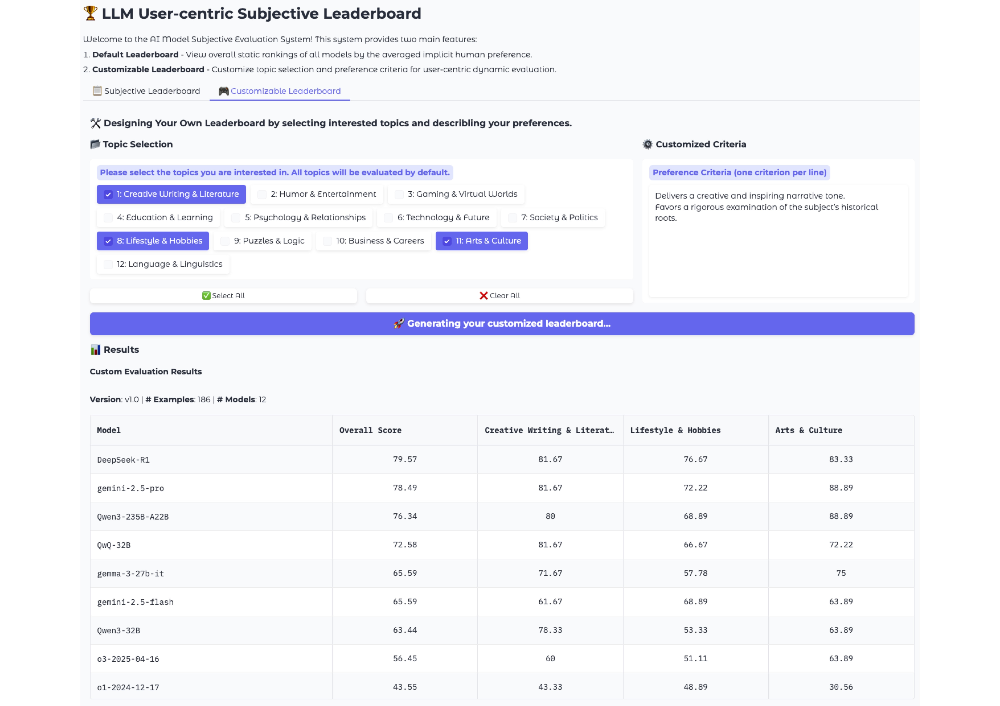

<div align= "center">
    <h1> User-centric Subjective Leaderboard via Customizable Reward Modeling </h1>
</div>


# Customizable Reward Modeling

## Requirements

* python >= 3.10
* pyTorch >= 2.4.0
* transformers >= 4.51.3
* trl >= 0.18.1
* Additional: `datasets`, `flash_attn`, etc.

The important dependencies and their version information are listed in the `requirements.txt` file.


## Data Format

Examples of training / test data use the **JSON Lines** format (one sample per line):

```json
{
  "idx": 0,
  "prompt": "user initial query",
  "model_a": [{'role': 'user', 'content': '...'}, {'role': 'assistant', 'content': '...'}],
  "model_b": [{'role': 'user', 'content': '...'}, {'role': 'assistant', 'content': '...'}],
  "criteria": ["...", "...", "..."],
  "preference": "model_a"  // or "model_b" or "tie"
}
```


## Train a Customizable Reward Model

A script for training pointwise customizable reward model is provided:

```bash
bash scripts/train_rm.sh
```

A script for training pairwise customizable reward model is provided:

```bash
bash scripts/train_rm_pair.sh
```

Key custom arguments:

| Argument | Description |
|----------|-------------|
| `--model_name_or_path` | Path to the model checkpoint |
| `--data_path` | Path to the training/validation file |
| `--data_direction` | `original` / `reverse` / `random` — controls the order of chosen vs. rejected |
| `--data_noise` | `none` / `add` / `remove` / `replace` / `random` — manipulates noising strategy for criteria  |

## Evaluate a Reward Model

Run the example script:

```bash
bash scripts/eval.sh
```

# User-centric Subjective Leaderboard

Based on CRMs, we introduce the first User-centric Subjective Leaderboard (USL), enabling dynamic LLM rankings customizable to individual user preferences and needs.

An screenshot of the interactive interface is shown below. Users can select topics of interest and input personalized preference criteria to obtain a customized model leaderboard.

<h1 align="center">

</h1>

# Project Layout

```text
.
├── data/
│   ├── train_val_data.jsonl            # training data
│   ├── test_set/                       # test data 
│   ├── subjective_leaderboard_test_set.jsonl # benchmark data for USL
│   └──
├── src/                                
│   ├── data/                           # datasets & collators
│   ├── trainer/                        # custom trainers for reward modeling
│   ├── utils/                          # common helpers, metrics, seeding
│       └── prompt.py                       # system / user prompt templates
│   ├── train_rm.py                     # point-wise RM training entry
│   ├── train_rm_pair.py                # pair-wise RM training entry
│   └── eval.py                         # evaluation entry
├── scripts/                            # one-line bash wrappers
│   ├── train_rm.sh
│   ├── train_rm_pair.sh
│   └── eval.sh
└── README.md
```
